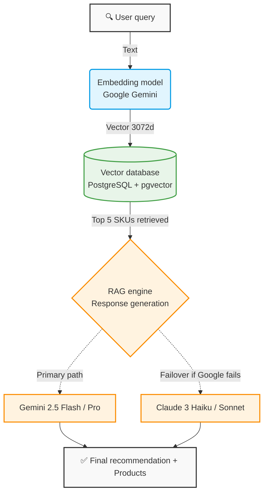

## Overview

SKU Semantic Search is built on a modern, production-ready architecture that combines vector databases, semantic embeddings, and AI-powered text generation with built-in resilience.

<Info>
  The system uses **PostgreSQL with pgvector** for vector storage and **Google Gemini** as the primary AI provider, with **Anthropic Claude** as a failover option.
</Info>

## Architecture diagram

The following diagram shows how user queries flow through the system:



## Core components

### FastAPI application layer

The application is initialized in `app/main.py:14` with CORS middleware and automatic database setup:

```python app/main.py
from fastapi import FastAPI
from fastapi.middleware.cors import CORSMiddleware
from app.core.config import settings

def create_tables():
    with engine.connect() as conn:
        conn.execute(text("CREATE EXTENSION IF NOT EXISTS vector"))
        conn.commit()
    Base.metadata.create_all(bind=engine)

app = FastAPI(title=settings.PROJECT_NAME, version=settings.VERSION)

# Configure CORS for cross-origin requests
app.add_middleware(
    CORSMiddleware,
    allow_origins=["http://localhost:4200"],
    allow_credentials=True,
    allow_methods=["*"],
    allow_headers=["*"],
)

create_tables()
```

<Note>
  The `create_tables()` function automatically creates the pgvector extension on startup, ensuring vector search capabilities are available.
</Note>

### PostgreSQL with pgvector extension

The database model in `app/models/product.py:14` defines a 3072-dimensional vector column:

```python app/models/product.py
from sqlalchemy import Column, Integer, String, Text
from pgvector.sqlalchemy import Vector

class Product(Base):
    __tablename__ = "products"

    id = Column(Integer, primary_key=True, index=True)
    name = Column(String, index=True, nullable=False)
    description = Column(Text, nullable=True)
    category = Column(String, index=True)
    
    # Vector of 3072 dimensions for Gemini embeddings
    embedding = Column(Vector(3072))
```

The 3072-dimension vector matches Google Gemini's `text-embedding-004` model output size, storing semantic representations of product descriptions.

### Multi-LLM service layer

The `LLMService` in `app/services/llm_service.py:13-26` configures multiple AI providers in a hierarchical fallback system:

```python app/services/llm_service.py
class LLMService:
    # Hierarchical configuration
    LLM_CONFIG = [
        {
            "provider": "google",
            "models": [
                'models/gemini-2.5-flash', 
                'models/gemini-flash-latest', 
                'models/gemini-2.5-pro'
            ]
        },
        {
            "provider": "anthropic",
            "models": ['claude-3-haiku-20240307', 'claude-3-5-sonnet-20240620']
        }
    ]
```

<Warning>
  The system requires valid API keys for both **GEMINI_API_KEY** and **ANTHROPIC_API_KEY** in your environment configuration to enable full failover functionality.
</Warning>

## Request flow

When a user submits a search query, the system processes it through the following stages:

<Accordion title="Stage 1: Request validation">
  FastAPI receives the query and validates it using Pydantic schemas defined in `app/schemas/product_schema.py`. The `ProductSearchQuery` model ensures proper data structure.
</Accordion>

<Accordion title="Stage 2: Embedding generation">
  The query text is converted into a 3072-dimensional vector using Google Gemini's embedding model (`gemini-embedding-001`). This happens in `app/services/llm_service.py:46-61`.
</Accordion>

<Accordion title="Stage 3: Vector search">
  PostgreSQL's pgvector extension performs cosine similarity search to find the top 5 most semantically similar products. This is executed in `app/services/product_service.py:26-39`.
</Accordion>

<Accordion title="Stage 4: RAG-based generation">
  The retrieved products are passed as context to the LLM, which generates a natural language recommendation. The system tries Gemini models first, then falls back to Claude if needed. This logic is in `app/services/llm_service.py:64-88`.
</Accordion>

<Accordion title="Stage 5: Response formatting">
  The API endpoint in `app/api/endpoints/products.py:14-29` combines the AI recommendation with the product list and returns a structured JSON response.
</Accordion>

## Technology stack

<CardGroup cols={2}>
  <Card title="Backend framework" icon="server">
    **FastAPI** - High-performance async web framework with automatic OpenAPI documentation
  </Card>
  <Card title="Database" icon="database">
    **PostgreSQL + pgvector** - Relational database with vector similarity search extension
  </Card>
  <Card title="AI providers" icon="brain">
    **Google Gemini & Anthropic Claude** - Multi-provider LLM setup with automatic failover
  </Card>
  <Card title="ORM layer" icon="diagram-project">
    **SQLAlchemy** - Python SQL toolkit with type-safe model definitions
  </Card>
</CardGroup>

## Scalability considerations

### Database indexing

For production deployments with large product catalogs, consider adding vector indexes:

```sql
CREATE INDEX ON products USING ivfflat (embedding vector_cosine_ops)
WITH (lists = 100);
```

### Caching layer

<Info>
  Implement Redis caching for frequently searched queries to reduce API calls to embedding providers and improve response times.
</Info>

### Rate limiting

Both Google Gemini and Anthropic Claude have API rate limits. The current implementation handles errors gracefully but doesn't implement request throttling. Consider adding rate limiting middleware for production use.

## Next steps

<CardGroup cols={2}>
  <Card title="RAG pattern" icon="book" href="/concepts/rag-pattern">
    Learn how Retrieval-Augmented Generation prevents AI hallucinations
  </Card>
  <Card title="Vector search" icon="magnifying-glass" href="/concepts/vector-search">
    Deep dive into semantic search with pgvector
  </Card>
  <Card title="Multi-LLM failover" icon="shield" href="/concepts/multi-llm-failover">
    Understand the resilient AI provider system
  </Card>
  <Card title="API reference" icon="code" href="/api/products/search">
    Explore the complete API documentation
  </Card>
</CardGroup>