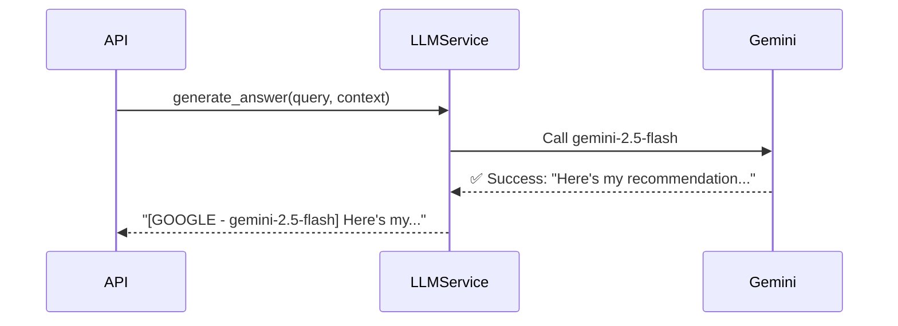
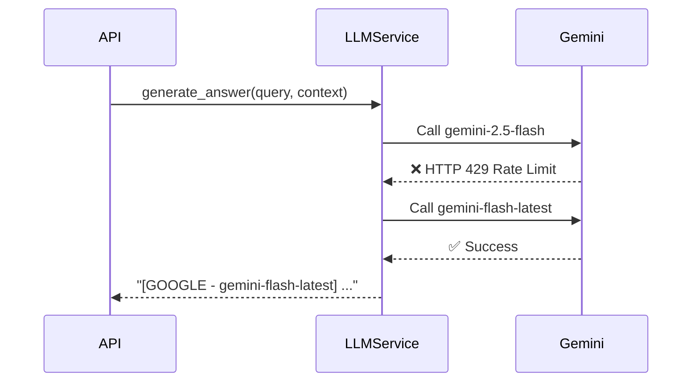
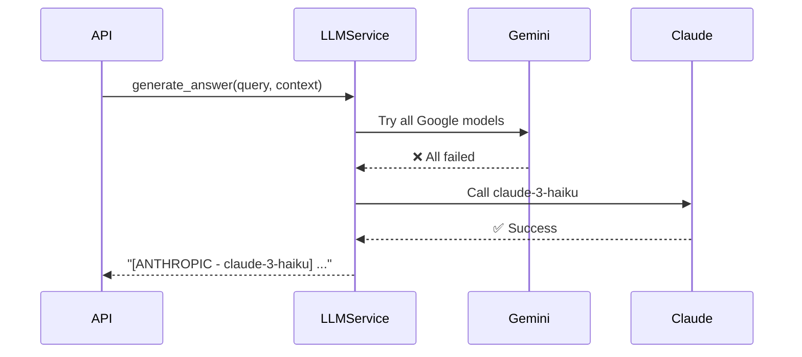
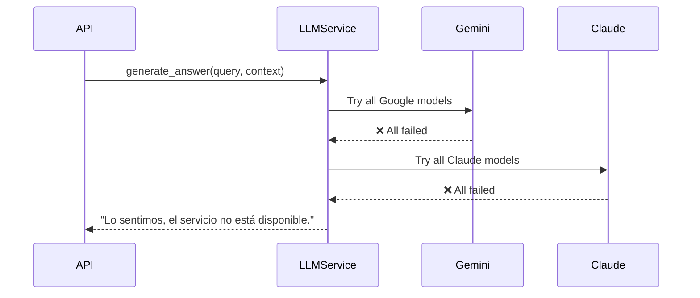

## The reliability challenge

AI providers like Google Gemini and Anthropic Claude are powerful, but they're not immune to failures:

- **Rate limits:** Exceeded quota during high traffic
- **Network issues:** Temporary connectivity problems
- **Service outages:** Provider downtime or maintenance
- **Model unavailability:** Specific models being deprecated or temporarily disabled

<Warning>
  Relying on a single AI provider creates a **single point of failure** that can bring down your entire application.
</Warning>

## Multi-provider architecture

This project implements a **hierarchical failover system** that automatically tries multiple AI providers and models in a defined order until one succeeds.

### Configuration structure

The `LLM_CONFIG` in `app/services/llm_service.py:13-26` defines the failover hierarchy:

```python app/services/llm_service.py
class LLMService:
    # Hierarchical configuration
    LLM_CONFIG = [
        {
            "provider": "google",
            "models": [
                'models/gemini-2.5-flash',     # Fastest, try first
                'models/gemini-flash-latest',  # Alternative fast model
                'models/gemini-2.5-pro'        # More capable fallback
            ]
        },
        {
            "provider": "anthropic",
            "models": [
                'claude-3-haiku-20240307',      # Fast and cost-effective
                'claude-3-5-sonnet-20240620'    # Most capable
            ]
        }
    ]
```

<Info>
  The system tries models **in the order listed**, stopping at the first successful response. This means you can optimize for speed (faster models first) or capability (better models first).
</Info>

## Failover logic

### The retry loop

The `generate_answer()` method in `app/services/llm_service.py:64-88` implements the core failover logic:

```python app/services/llm_service.py
@staticmethod
def generate_answer(query: str, context: str) -> str:
    prompt = (
        f"Eres un analista de Listo ERP. Basado en este contexto:\n{context}\n\n"
        f"Pregunta: {query}\nRespuesta profesional y breve:"
    )

    for entry in LLMService.LLM_CONFIG:
        provider = entry["provider"]
        for model_name in entry["models"]:
            try:
                if provider == "google":
                    res = LLMService._call_google(model_name, prompt)
                elif provider == "anthropic":
                    res = LLMService._call_anthropic(model_name, prompt)
                
                return f"[{provider.upper()} - {model_name}] {res}"
            
            except (APIStatusError, APIConnectionError) as e:
                print(f"⚠️ Network/status error in {provider} ({model_name}): {e}")
                continue  # Try next model
            except Exception as e:
                print(f"❌ Unexpected error in {model_name}: {str(e)[:50]}")
                continue

    return "Lo sentimos, el servicio de recomendaciones no está disponible."
```

<Note>
  The function returns **immediately** on the first successful response, making it efficient when the primary provider is healthy.
</Note>

### Error handling

The system catches two categories of errors:

<Accordion title="Network and API errors">
  **Exceptions:** `APIStatusError`, `APIConnectionError`
  
  **Causes:**
  - HTTP 429 (rate limit exceeded)
  - HTTP 503 (service unavailable)
  - Network timeouts
  - DNS resolution failures
  
  **Action:** Immediately try the next model in the configuration
</Accordion>

<Accordion title="Unexpected errors">
  **Exceptions:** Generic `Exception` catch-all
  
  **Causes:**
  - Invalid API keys
  - Malformed requests
  - Model-specific errors
  - Unexpected response formats
  
  **Action:** Log the error (truncated to 50 chars) and continue to next model
</Accordion>

## Provider implementations

### Google Gemini integration

The `_call_google()` method in `app/services/llm_service.py:29-32` handles Gemini API calls:

```python app/services/llm_service.py
@staticmethod
def _call_google(model_name: str, prompt: str):
    model = genai.GenerativeModel(model_name)
    response = model.generate_content(prompt)
    return response.text
```

<Info>
  Gemini models are optimized for low latency and cost-effectiveness, making them ideal as the **primary provider**.
</Info>

### Anthropic Claude integration

The `_call_anthropic()` method in `app/services/llm_service.py:35-43` uses the Messages API:

```python app/services/llm_service.py
@staticmethod
def _call_anthropic(model_name: str, prompt: str):
    # Use the official API structure: client.messages.create
    message = anthropic_client.messages.create(
        max_tokens=1024,
        messages=[{"role": "user", "content": prompt}],
        model=model_name,
    )
    # Claude returns content as a list of blocks
    return message.content[0].text
```

<Note>
  Claude's response structure is different from Gemini's — it returns a `content` list rather than direct text. The code extracts `message.content[0].text` to normalize the output.
</Note>

## Failover scenarios

### Scenario 1: Normal operation



**Outcome:** Fast response from the primary provider.

### Scenario 2: Rate limit on primary model



**Outcome:** Automatic retry with an alternative Gemini model.

### Scenario 3: Complete Google outage



**Outcome:** Seamless failover to Claude with minimal downtime.

### Scenario 4: Total failure



**Outcome:** Graceful degradation with a user-friendly error message.

## Configuration best practices

### Ordering strategies

<Tabs>
  <Tab title="Cost-optimized">
    Put cheaper models first:
    
    ```python
    LLM_CONFIG = [
        {"provider": "google", "models": ['gemini-2.5-flash']},  # Cheapest
        {"provider": "anthropic", "models": ['claude-3-haiku']},
        {"provider": "google", "models": ['gemini-2.5-pro']},     # Expensive fallback
    ]
    ```
  </Tab>
  
  <Tab title="Quality-optimized">
    Put most capable models first:
    
    ```python
    LLM_CONFIG = [
        {"provider": "google", "models": ['gemini-2.5-pro']},
        {"provider": "anthropic", "models": ['claude-3-5-sonnet']},
        {"provider": "google", "models": ['gemini-2.5-flash']},
    ]
    ```
  </Tab>
  
  <Tab title="Latency-optimized">
    Put fastest models first:
    
    ```python
    LLM_CONFIG = [
        {"provider": "google", "models": ['gemini-2.5-flash']},
        {"provider": "anthropic", "models": ['claude-3-haiku']},
    ]
    ```
  </Tab>
  
  <Tab title="Balanced">
    Current project configuration — fast primary, capable fallback:
    
    ```python
    LLM_CONFIG = [
        {"provider": "google", "models": [
            'gemini-2.5-flash',
            'gemini-2.5-pro'
        ]},
        {"provider": "anthropic", "models": [
            'claude-3-haiku',
            'claude-3-5-sonnet'
        ]}
    ]
    ```
  </Tab>
</Tabs>

### Environment variables

Both API keys must be configured in your `.env` file:

```bash .env
GEMINI_API_KEY=your_google_api_key_here
ANTHROPIC_API_KEY=your_anthropic_api_key_here
```

<Warning>
  **Never commit API keys to version control.** Use environment variables and add `.env` to your `.gitignore`.
</Warning>

The keys are loaded in `app/services/llm_service.py:7-9`:

```python app/services/llm_service.py
from app.core.config import settings

genai.configure(api_key=settings.GEMINI_API_KEY)
anthropic_client = Anthropic(api_key=settings.ANTHROPIC_API_KEY)
```

## Monitoring and observability

### Logging failover events

The current implementation prints errors to console:

```python
print(f"⚠️ Network/status error in {provider} ({model_name}): {e}")
print(f"❌ Unexpected error in {model_name}: {str(e)[:50]}")
```

For production, enhance this with structured logging:

<CodeGroup>
```python Structured logging
import logging

logger = logging.getLogger(__name__)

logger.warning(
    "LLM failover triggered",
    extra={
        "provider": provider,
        "model": model_name,
        "error_type": type(e).__name__,
        "query": query[:100]  # Truncate for privacy
    }
)
```

```python Metrics tracking
from prometheus_client import Counter

llm_requests = Counter(
    'llm_requests_total',
    'Total LLM requests',
    ['provider', 'model', 'status']
)

llm_requests.labels(
    provider=provider,
    model=model_name,
    status='success'
).inc()
```
</CodeGroup>

### Key metrics to track

<CardGroup cols={2}>
  <Card title="Provider success rate" icon="chart-line">
    Percentage of requests handled by each provider
  </Card>
  <Card title="Failover frequency" icon="rotate">
    How often the system falls back to secondary providers
  </Card>
  <Card title="Response latency" icon="clock">
    Time to first successful response (including retries)
  </Card>
  <Card title="Total failure rate" icon="triangle-exclamation">
    Requests where all providers failed
  </Card>
</CardGroup>

## Advanced patterns

### Circuit breaker

Prevent cascading failures by temporarily skipping known-broken providers:

```python
from datetime import datetime, timedelta

class CircuitBreaker:
    def __init__(self, failure_threshold=5, timeout=60):
        self.failures = {}
        self.threshold = failure_threshold
        self.timeout = timedelta(seconds=timeout)
    
    def is_open(self, provider):
        if provider not in self.failures:
            return False
        
        count, last_failure = self.failures[provider]
        
        # Reset if timeout elapsed
        if datetime.now() - last_failure > self.timeout:
            del self.failures[provider]
            return False
        
        return count >= self.threshold
    
    def record_failure(self, provider):
        if provider in self.failures:
            count, _ = self.failures[provider]
            self.failures[provider] = (count + 1, datetime.now())
        else:
            self.failures[provider] = (1, datetime.now())
```

### Parallel requests (fastest wins)

For critical low-latency use cases, call multiple providers simultaneously:

```python
import asyncio

async def generate_answer_parallel(query: str, context: str) -> str:
    tasks = [
        call_google_async("gemini-2.5-flash", prompt),
        call_anthropic_async("claude-3-haiku", prompt)
    ]
    
    # Return first successful response
    for task in asyncio.as_completed(tasks):
        try:
            return await task
        except Exception:
            continue
    
    return "Service unavailable"
```

<Warning>
  **Cost consideration:** Parallel requests consume quota from multiple providers simultaneously. Use this pattern only when latency is critical.
</Warning>

## Testing failover behavior

### Simulating provider failures

<CodeGroup>
```python Force Google failure
import google.generativeai as genai
from unittest.mock import patch

@patch('google.generativeai.GenerativeModel.generate_content')
def test_google_failover(mock_generate):
    mock_generate.side_effect = APIConnectionError("Simulated failure")
    
    result = LLMService.generate_answer("test query", "test context")
    
    # Should fall back to Claude
    assert "ANTHROPIC" in result
```

```python Force all providers to fail
@patch('google.generativeai.GenerativeModel.generate_content')
@patch('anthropic.Anthropic.messages.create')
def test_total_failure(mock_anthropic, mock_google):
    mock_google.side_effect = Exception("Google down")
    mock_anthropic.side_effect = Exception("Claude down")
    
    result = LLMService.generate_answer("test query", "test context")
    
    assert result == "Lo sentimos, el servicio de recomendaciones no está disponible."
```
</CodeGroup>

## Next steps

<CardGroup cols={2}>
  <Card title="RAG pattern" icon="book" href="/concepts/rag-pattern">
    Learn how multi-LLM failover integrates with RAG
  </Card>
  <Card title="System architecture" icon="sitemap" href="/concepts/architecture">
    See the complete system design
  </Card>
  <Card title="Development guide" icon="code" href="/guides/setup">
    Set up the project locally and configure API keys
  </Card>
  <Card title="API reference" icon="book-open" href="/api/products/search">
    Explore the search endpoint that uses this system
  </Card>
</CardGroup>