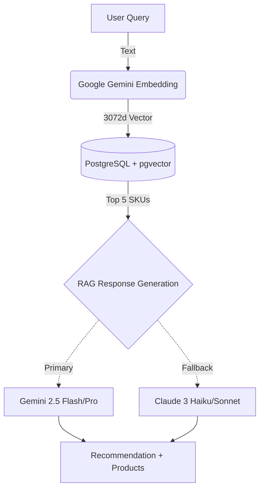

# SKU Semantic Search

SKU Semantic Search is a proof-of-concept API service that transforms how users discover products. Instead of requiring exact keyword matches, it understands natural language intent and returns relevant results powered by RAG (Retrieval-Augmented Generation) and vector embeddings.

## What it does

Traditional search engines require users to type exact product names (e.g., "broom"). This project explores a smarter approach: understanding user intent (e.g., "something to clean the floor") and returning semantically relevant products with AI-generated recommendations.

<Note>
This is a personal learning project built to practice integrating AI models, vector databases, and resilient API design patterns.
</Note>

## How it works

When a user submits a search query, the system:

1. **Converts the query to a vector embedding** using Google Gemini's embedding model (3072 dimensions)
2. **Performs cosine similarity search** in PostgreSQL with pgvector to find semantically similar products
3. **Retrieves top matching SKUs** from the vector database
4. **Generates contextual recommendations** using the RAG pattern with retrieved product data
5. **Ensures resilience** with multi-LLM failover (Gemini → Claude) if the primary provider fails



## Key features

<CardGroup cols={2}>
  <Card title="Semantic search" icon="magnifying-glass">
    Vector embeddings enable intent-based product discovery beyond keyword matching
  </Card>
  <Card title="RAG pattern" icon="book-sparkles">
    AI recommendations grounded in real database products to prevent hallucinations
  </Card>
  <Card title="Multi-LLM failover" icon="shield-check">
    Automatic fallback from Gemini to Claude ensures high availability
  </Card>
  <Card title="Vector database" icon="database">
    PostgreSQL with pgvector extension for fast cosine similarity search
  </Card>
</CardGroup>

## Technology stack

**Backend**
- FastAPI for high-performance async API endpoints
- SQLAlchemy for database ORM and migrations
- Pydantic for strict data validation
- Python 3.13

**Database**
- PostgreSQL 16 with pgvector extension for vector operations
- Docker containerization for easy deployment

**AI integrations**
- Google Generative AI SDK (Gemini embedding-001, Gemini 2.5 Flash/Pro)
- Anthropic SDK (Claude 3 Haiku, Claude 3.5 Sonnet)
- Hierarchical failover strategy across providers and models

## Architecture highlights

**Request flow**

The system processes search requests through a carefully designed pipeline:

1. **FastAPI + Pydantic validation** - Strictly validates incoming search queries to prevent malformed requests
2. **Embedding generation** - Converts text to 3072-dimensional vectors using Gemini's embedding model
3. **Vector similarity search** - PostgreSQL executes cosine distance queries against the vector index
4. **RAG context assembly** - Formats retrieved products as strict context for the LLM
5. **Multi-provider resilience** - Attempts response generation across configured models and providers

**Failover strategy**

The LLM service implements hierarchical failover across multiple providers and models (app/services/llm_service.py:13):

```python
LLM_CONFIG = [
    {
        "provider": "google",
        "models": [
            'models/gemini-2.5-flash', 
            'models/gemini-flash-latest', 
            'models/gemini-2.5-pro'
        ]
    },
    {
        "provider": "anthropic",
        "models": ['claude-3-haiku-20240307', 'claude-3-5-sonnet-20240620']
    }
]
```

If a model fails due to rate limits, network errors, or API issues, the system automatically tries the next model in the hierarchy.

## Use cases

<CardGroup cols={2}>
  <Card title="E-commerce search" icon="cart-shopping">
    Enable customers to find products using natural descriptions
  </Card>
  <Card title="Inventory discovery" icon="warehouse">
    Help warehouse staff locate items by description rather than SKU codes
  </Card>
  <Card title="Product recommendations" icon="sparkles">
    Generate contextual suggestions based on user needs
  </Card>
  <Card title="Voice search" icon="microphone">
    Process conversational queries for hands-free shopping
  </Card>
</CardGroup>

## Next steps

<CardGroup cols={3}>
  <Card title="Quickstart" icon="rocket" href="/quickstart">
    Get the API running locally in minutes
  </Card>
  <Card title="Architecture" icon="sitemap" href="/concepts/architecture">
    Deep dive into system design and data flow
  </Card>
  <Card title="API reference" icon="code" href="/api/overview">
    Explore all available endpoints
  </Card>
</CardGroup>

## Project goals

<Tip>
This project was built as a learning exercise to practice:
- Integrating AI models and vector databases
- Implementing resilient multi-provider architectures
- Building production-grade APIs with FastAPI
- Understanding RAG patterns beyond simple chatbots
</Tip>

The goal was to create a semantic search engine that understands user intent, retrieves relevant products from a real database, and generates grounded AI recommendations without hallucinations.